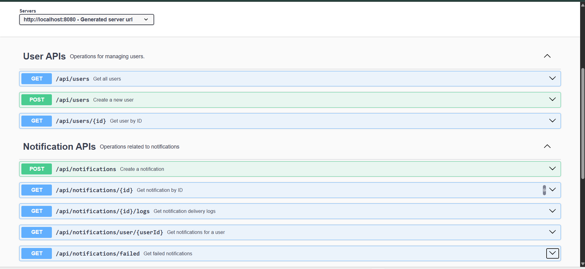

# 🔔 Notification System

A Spring Boot backend application that demonstrates asynchronous notification processing using **AWS SNS** and **AWS SQS**. The system supports **Email**, **SMS**, and **Push** notifications while using **Spring AI (Ollama)** to generate notification messages and classify their priority before delivery.

The project follows a layered architecture and is designed to separate notification publishing, message processing, and channel-specific delivery.

---

## Features

* AI-generated notification messages using Spring AI (Ollama)
* AI-based notification priority classification
* Asynchronous notification processing using AWS SNS and SQS
* Multi-channel notification delivery (Email, SMS, Push)
* Notification delivery tracking and logging
* User management APIs
* Global exception handling
* RESTful APIs built using layered architecture

---

## Tech Stack

| Category   | Technologies                |
| ---------- | --------------------------- |
| Language   | Java                        |
| Framework  | Spring Boot                 |
| Database   | MySQL                       |
| ORM        | Spring Data JPA (Hibernate) |
| Messaging  | AWS SNS, AWS SQS            |
| AI         | Spring AI (Ollama)          |
| Build Tool | Maven                       |
| API Docs | Swagger UI, OpenAPI |
---

## Notification Flow

```text
Client
   │
   ▼
REST API
   │
   ▼
NotificationController
   │
   ▼
NotificationService
   │
   ├── Generate notification message (Spring AI)
   ├── Classify priority (Spring AI)
   ├── Save notification (MySQL)
   └── Publish event (AWS SNS)
                    │
                    ▼
               AWS SNS Topic
                    │
        ┌───────────┼───────────┐
        ▼           ▼           ▼
   Email Queue   SMS Queue   Push Queue
        │           │           │
        ▼           ▼           ▼
 Email Handler  SMS Handler  Push Handler
                    │
                    ▼
          Delivery Tracking & Logs
```

---

## Project Structure

```text
src/main/java
├── aws
│   ├── sns
│   └── sqs
├── config
├── controller
├── dto
├── entity
├── enums
├── exception
├── notification
│   ├── email
│   ├── sms
│   └── push
├── repository
└── service
```

---

## REST APIs

### User APIs

| Method | Endpoint          |
| ------ | ----------------- |
| POST   | `/api/users`      |
| GET    | `/api/users`      |
| GET    | `/api/users/{id}` |

### Notification APIs

| Method | Endpoint                           |
| ------ | ---------------------------------- |
| POST   | `/api/notifications`               |
| GET    | `/api/notifications/{id}`          |
| GET    | `/api/notifications/user/{userId}` |
| GET    | `/api/notifications/{id}/logs`     |
| GET    | `/api/notifications/failed`        |

---

## Getting Started

### Prerequisites

* Java
* Maven
* MySQL
* AWS Account
* Ollama

### Configuration

The project uses environment variables for sensitive configuration.

Configure the following before running the application:

* Database credentials
* AWS credentials
* SNS Topic ARN
* SQS Queue URLs
* Mail credentials

Refer to `application-example.properties` for the required configuration.

---

## Architecture Highlights

* Layered architecture (Controller → Service → Repository)
* Event-driven communication using AWS SNS and SQS
* Dedicated handlers for Email, SMS, and Push notifications
* DTO-based request and response models
* Centralized exception handling
* Delivery tracking with notification logs

---
## API Documentation

Interactive API documentation is available through Swagger UI after starting the application:

`http://localhost:8080/swagger-ui/index.html`

OpenAPI specification:

`http://localhost:8080/v3/api-docs`



## Author

**Randeep**
